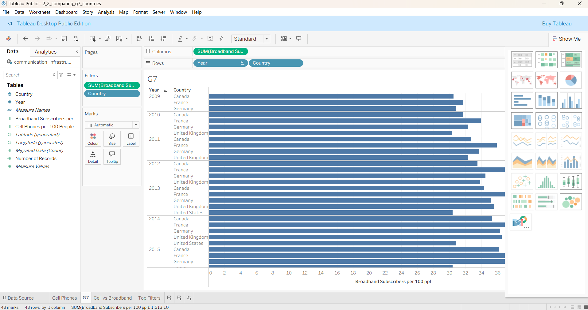
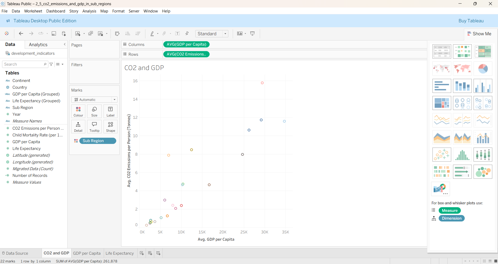
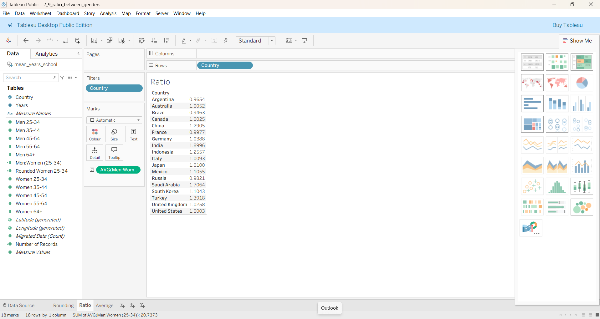
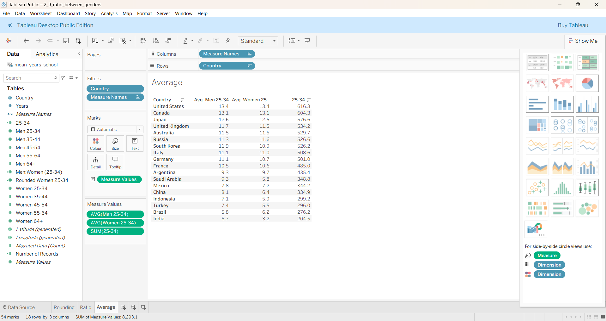

# Tableau – Building and Customising Visualisations

**Tool**: Tableau  
**Dataset**: G7 education, social & infrastructure data  
**Skills Practised**:  
- Filtering and sorting  
- Aggregating measures and dimensions  
- Scatter plots and calculated fields  

**Description**:  
This chapter explored core data analysis techniques in Tableau. I practised filtering and sorting data across G7 countries, created scatter plots of CO2 emissions vs GDP with aggregations, and applied calculated fields to measure gender ratios and averages.  

**Highlight Output(s):**

  
  
  

