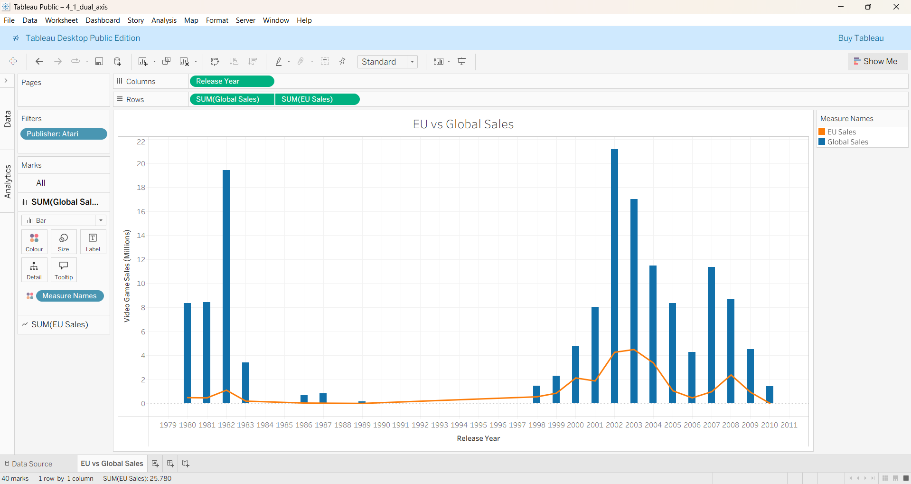
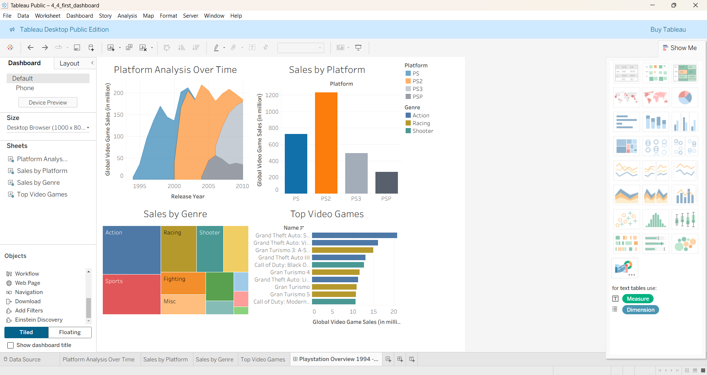
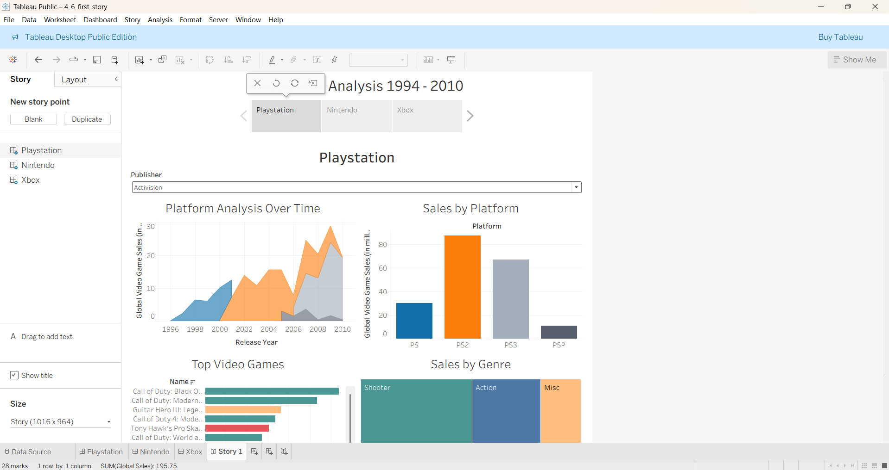

# Tableau – Presenting Your Data

**Tool**: Tableau  
**Dataset**: Video game sales  
**Skills Practised**:  
- Dual-axis visualisations  
- Dashboard design and interactivity  
- Storytelling with data  

**Description**:  
The final Tableau chapter focused on presentation and storytelling. I created a dual-axis graph, built a dashboard combining multiple charts for video game sales, and designed a story navigation sequence to communicate insights clearly and professionally.  

**Highlight Output(s):**

  
  

