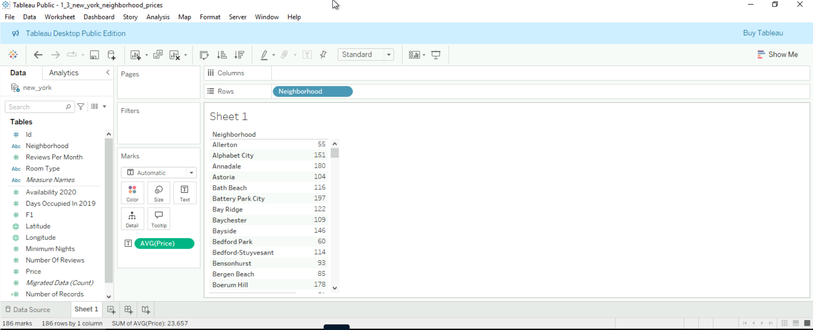
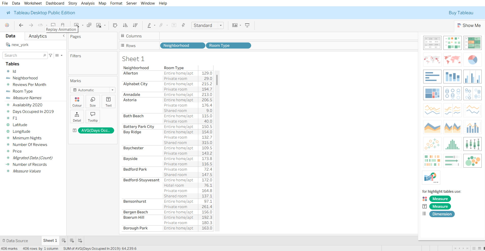
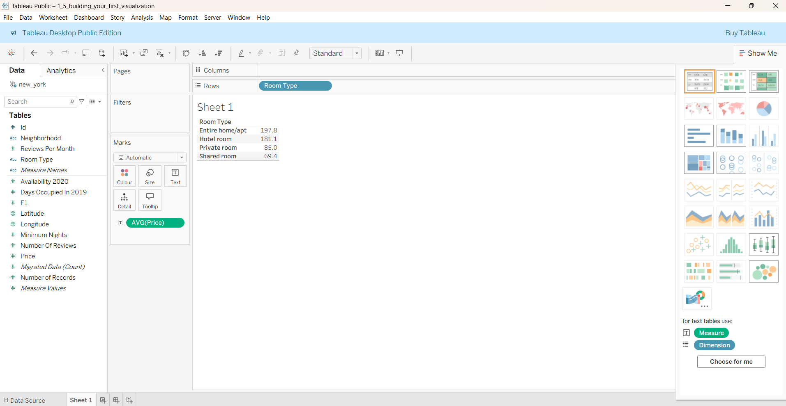

# Tableau – Getting Started

**Tool**: Tableau  
**Dataset**: Airbnb listings (Amsterdam & New York)  
**Skills Practised**:  
- Connecting to data sources  
- Dimensions vs. measures  
- Creating first visualisations  

**Description**:  
First Tableau project: explored Airbnb data. Created a bar chart of average prices by neighbourhood, segmented listings by room type, and combined these views into a complete visualisation.  

**Highlight Output(s):**  

  
  

