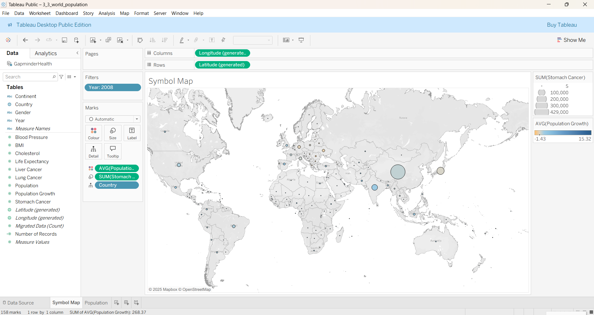
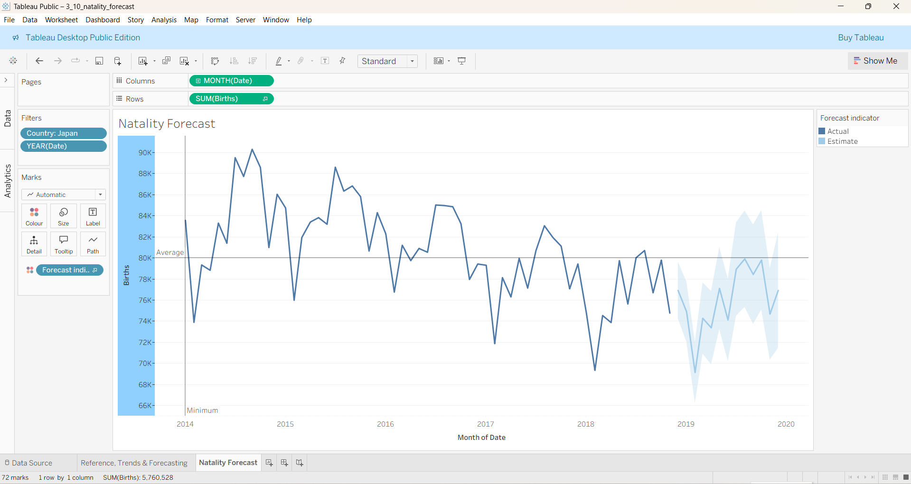

# Tableau – Mapping and Time Series

**Tool**: Tableau  
**Dataset**: World health & natality statistics  
**Skills Practised**:  
- Mapping data with symbol maps  
- Working with date hierarchies  
- Adding reference, trend, and forecasting lines  

**Description**:  
This chapter focused on geographic and temporal data. I created a world population symbol map to visualise geographic differences and built a natality time series with forecasting to project future trends.  

**Highlight Output(s):**

  

